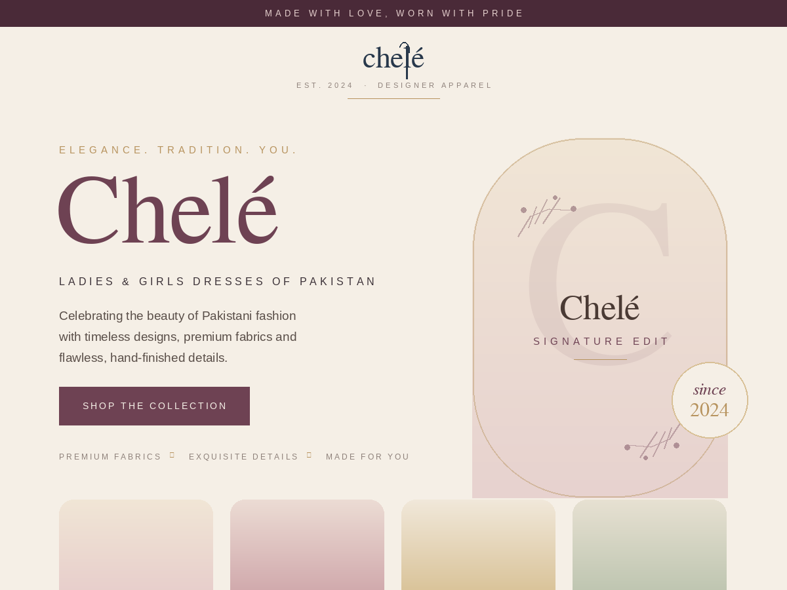

# Chelé — Premium WordPress Theme

**Elegance. Tradition. You.** — a luxury fashion-house WordPress theme for **Chelé**,
celebrating the beauty of Pakistani ladies & girls dresses with timeless designs,
premium fabrics and flawless details.

This theme is built to **deploy instantly**: upload it, activate it, and the homepage,
navigation, collections and a sample product catalogue are created for you — **no page
builder and no plugins required.**



---

## ✨ What you get

- **Luxury editorial homepage** — hero, brand marquee, four brand pillars, featured
  products, brand story, shop-by-collection grid, full-width lookbook, service promises,
  testimonials and a newsletter call-to-action.
- **Built-in Product showcase** — a custom *Products* post type with *Collections*,
  price / compare-at price / fabric / pieces / badge fields. **No WooCommerce needed**
  (but fully WooCommerce-compatible if you add it later).
- **Eight sample products** across Lawn, Formal, Luxury, Bridal, Girls & Pret —
  seeded automatically on activation so the site looks complete from minute one.
- **On-brand SVG artwork** — every product without a photo gets a tasteful, generated
  placeholder in the brand palette, so nothing ever looks broken. Upload a real photo and
  it takes over instantly.
- **The Chelé identity** — ivory · plum · dusty rose · antique gold palette, an elegant
  Cormorant Garamond / Jost / Pinyon Script type system, and a recreated needle-&-thread
  wordmark.
- **Fully responsive**, accessible (skip links, ARIA, reduced-motion support), fast
  (vanilla JS, no jQuery on the front end) and translation-ready.
- **Customizer controls** — edit hero copy, brand colours, announcement bar, social links
  and footer, all with live preview.
- **Block-editor ready** via `theme.json` (brand colour palette, fonts and layout).

---

## 🚀 Deploy instantly (recommended — 2 minutes)

You need a running WordPress site (self-hosted, or any host such as Bluehost, SiteGround,
Hostinger, Cloudways, etc.).

### Option A — Upload the ZIP

1. Build the installable ZIP (from this repo):
   ```bash
   ./build-zip.sh
   ```
   This creates **`chele.zip`** in the project root.
   *(No shell? Just zip the `chele/` folder so the ZIP contains a single `chele/` folder.)*

2. In WordPress admin go to **Appearance → Themes → Add New → Upload Theme**.
3. Choose **`chele.zip`**, click **Install Now**, then **Activate**.
4. Done. Visit your site — the homepage, menu, collections and sample products are
   already live. 🎉

### Option B — Copy the folder

Copy the **`chele/`** folder into `wp-content/themes/` on your server, then activate
**Chelé** under **Appearance → Themes**.

> On activation the theme creates: a static **Home** page, a **Journal** (blog) page,
> **About** and **Contact** pages, the **Primary** menu, six **Collections** and eight
> **sample products**. It never overwrites your content if run again.

---

## 🛠 Make it yours

| Task | Where |
| --- | --- |
| Upload your logo | **Appearance → Customize → Site Identity** (falls back to the Chelé wordmark) |
| Edit hero text & buttons | **Customize → Chelé Theme → Homepage Hero** |
| Change brand colours | **Customize → Chelé Theme → Brand Palette** |
| Set Instagram/Facebook/WhatsApp | **Customize → Chelé Theme → Social & Contact** |
| Announcement bar | **Customize → Chelé Theme → Brand & Announcement** |
| Add / edit products | **Products → Add New** (set a *Product Image*, price & collection) |
| Manage collections | **Products → Collections** |
| Menu | **Appearance → Menus** (Primary location) |

### Replacing the sample products with real ones
Open **Products** in the dashboard, edit any item, set a **Product Image** (featured
image) — your photo replaces the generated placeholder — and update the price/details in
the **Product Details** box. Add as many as you like.

### Selling online (optional)
Install **WooCommerce** and the theme automatically steps aside for WooCommerce's
catalogue, shows a cart icon and styles the add-to-cart button. Until then, each product
page offers an **“Enquire to Order”** button (WhatsApp / email) — perfect for order-on-DM
boutiques.

---

## 📁 Structure

```
chele/                     ← the WordPress theme (this is what you upload)
├── style.css              theme header + base
├── theme.json             block-editor palette, fonts, layout
├── functions.php          setup, assets, menus, includes
├── front-page.php         the luxury homepage
├── header.php / footer.php
├── archive-chele_product.php / single-chele_product.php / taxonomy-chele_collection.php
├── index.php / single.php / page.php / 404.php / search / comments
├── inc/
│   ├── product-cpt.php    Products + Collections (no plugin needed)
│   ├── sample-content.php instant demo storefront on activation
│   ├── template-tags.php  helpers + SVG placeholder engine
│   └── customizer.php     theme options + live preview
├── template-parts/        hero, pillars, products, story, collections, lookbook…
└── assets/                css / js / images
tools/generate-screenshot.py   regenerates chele/screenshot.png
build-zip.sh               packages chele/ into chele.zip
```

---

## Requirements
- WordPress **5.9+** · PHP **7.4+** (tested on PHP 8.4)
- An internet connection on the visitor's browser for Google Fonts (degrades gracefully to
  system serif/sans if blocked).

## License
GPL-2.0-or-later. Brand name and assets © Chelé.

*Made with love, worn with pride.*
